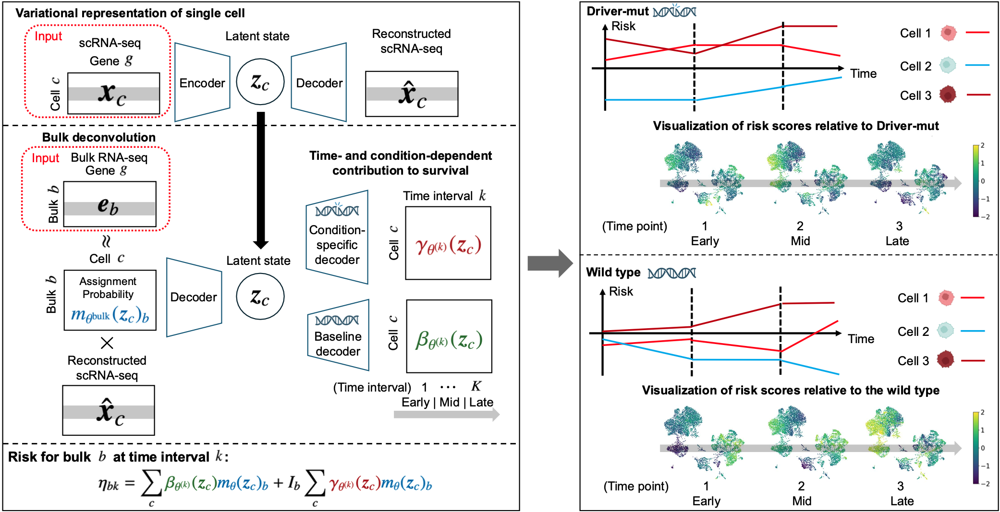

# scTCHM

## Description
scTCHM (single-cell Time- and Condition-dependent Hazard Model) is a novel deep generative framework that integrates single-cell latent representations from a VAE with bulk-level cell-type proportions and hazard coefficients.
This enables the computation of patient-level risk scores and the identification of cell populations whose prognostic impact dynamically changes across time and clinical conditions.

Teppei Shimamura's lab, Institute of Science Tokyo, Tokyo, Japan

  

## Model architecture
The model comprises three main components: VAE for latent representation of single cells, bulk deconvolution based on DeepCOLOR, and a conditional piecewise constant hazard model for time- and condition-dependent risk estimation.
